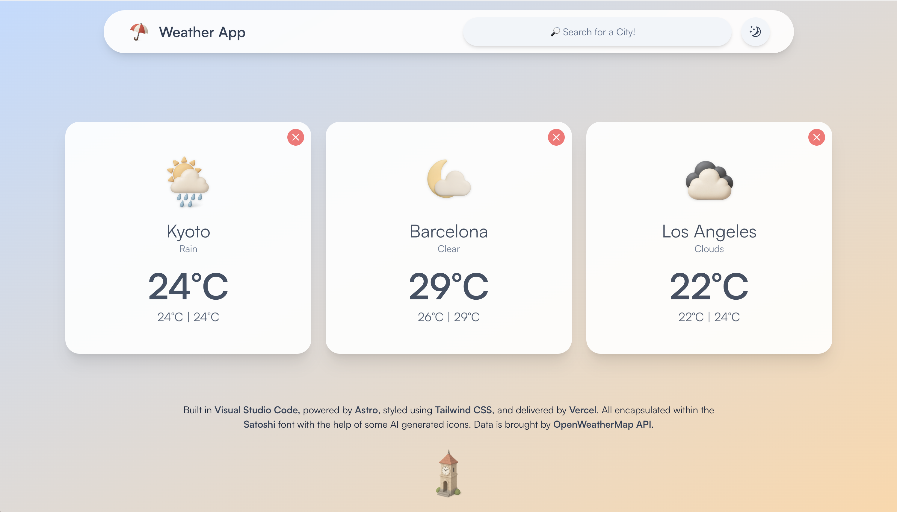

# Weather App V2

A modern, responsive weather application built with Astro, React, and Tailwind CSS. Get real-time weather forecasts for any city, with beautiful UI, dark/light mode, and detailed weather info.

## Features

- 🌤️ Search for any city and view current weather details
- 📊 See temperature, min/max, feels like, humidity, pressure, wind, sunrise/sunset
- 🌓 Toggle between light and dark mode
- 🗂️ Animated, responsive weather cards
- 🕰️ "Time Machine" modal to visit the previous version of the app
- 🚫 Prevents duplicate cities and handles errors gracefully
- ⚡ Fast, smooth UI with auto-animations
- 🖼️ Custom icons and Satoshi font

## Screenshots



## Getting Started

### Prerequisites

- Node.js (v18+ recommended)
- npm
- An OpenWeatherMap API key

### Setup

1. Clone the repository:
   ```sh
   git clone <repo-url>
   cd Weather-App-V2
   ```
2. Install dependencies:
   ```sh
   npm install
   ```
3. Create a `.env` file in the root and add your API key:
   ```env
   PUBLIC_API_KEY=your_openweathermap_api_key
   ```
4. Start the development server:
   ```sh
   npm run dev
   ```
   The app will be available at `http://localhost:4321`.

### Build for Production

```sh
npm run build
npm run preview
```

### Deployment

- Deploy easily to Vercel, Netlify, or any static host.
- Ensure your `PUBLIC_API_KEY` is set in your deployment environment variables.

## Credits

- [Astro](https://astro.build/)
- [React](https://react.dev/)
- [Tailwind CSS](https://tailwindcss.com/)
- [OpenWeatherMap API](https://openweathermap.org/api)
- [Fontshare Satoshi](https://www.fontshare.com/fonts/satoshi)

---

© 2025 Weather App V2. Built by Mateo Filip.
